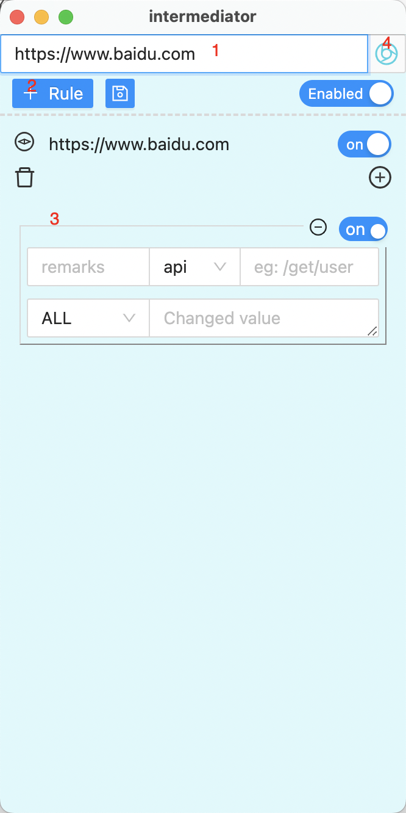

# Intermediator

EN/[简体](README_CN.md)

Intermediator is a lightweight open source tool for modifying interface return values on Windows (x64) and Mac systems.

You can use it to modify HTTP (S) response values, redirect static file
requests to the local file directory, and support batch modification of request
return values in a regular manner.

---

## How to use

1. Enter the URL containing http/https



2. Click Add Rule

3. Edit your rules

```Easily
     Currently, API, batch regular and path matching methods are 
     supported Enter the changed value/local path in the Changed value

     Eg: Select the path mode

     The input monitored api path supports fuzzy matching
     Enter the local path in the Changed value It is worth noting that 
     the path pattern matches the path, not the file

     Eg: Select the api mode

     The full value of the input monitored api path does not match the 
     GET parameter in the api temporarily? x= &y= In Changed value, 
     enter the request response result, right click the copy value 
     and modify it to the desired value
```

    4. Click the browser icon to see the effect

## Intermediator Workflow

| life cycle                                                       | Intermediator implement                                                                                                                                                      | Read Write Disk | New process | Listening port |
| ---------------------------------------------------------------- | ---------------------------------------------------------------------------------------------------------------------------------------------------------------------------- | --------------- | ----------- | -------------- |
| open                                                             | Read the rule file Rule.qy in the software directory                                                                                                                         | √               | x           | x              |
| initialization                                                   | Apply the rules saved by the Save button and select the first rule by default                                                                                                | x               | x           | x              |
| Click Add Rule                                                   | Modify state value only                                                                                                                                                      | x               | x           | x              |
| Click Save Rule                                                  | Write the current rule to Rule.qy                                                                                                                                            | √               | x           | x              |
| Click to open the browser                                        | Start the local node process and only apply the rules of the current URL to build the proxy service. Open the built-in browser to inject proxy rules and open devTools       | √               | √           | √              |
| Click again to open the browser after changing the rules         | Start the local node process to listen to the new port, build a new rule proxy server for the current URL, and open a new window of the built-in browser to inject the proxy | √               | √           | √              |
| Click again to open the browser after changing the URL and rules | ditto                                                                                                                                                                        | √               | √           | √              |
| Close a browser window                                           | Do nothing                                                                                                                                                                   | x               | x           | x              |
| Close all windows                                                | End the process and shut down all agent services                                                                                                                             | x               | x           | x              |

## 

## Send your feedback

    You can give feedback directly in ISSUES

    [Issues · name-q/intermediator · GitHub](https://github.com/name-q/intermediator/issues)

## Download link

    mac:

        Intel chip Download Intermediator-1.0.0.dmg 

        M1 or M2 chip Download Intermediator-1.0.0-arm64.dmg

    win: 

        Installation package for 64 bit systems only Download Intermediator.Setup.1.0.0.exe

    [Release Intermediator · name-q/intermediator · GitHub](https://github.com/name-q/intermediator/releases/tag/PublicTest)

## common problem

Q：What's the difference with PostMan

A：PostMan is mainly used for back-end debugging interface, and Mediator is used for front-end debugging page

Q：Common usage scenarios

A： 1. Some environments have data but cannot be directly connected. You can copy the value to your environment

2. Modify a value to let the front-end engineer see the modified effect

3. Map multiple static file requests to the local hot update compiled directory

Q：Why not support PC global request acquisition

A：The global request must modify your network proxy&trust the CA certificate generated by us

When using VPN or other proxy software, there will be competition for network proxy. Of course, we

You can inject some software, such as Chrome, to support the injection of insecure CAs and proxies.

There are many tools for packet capture and modification in the market, such as charles fiddler wireshark

There are fees and learning costs. We only proxy our own browser without pollution.

It can be achieved by packet capturing tools, but it does not conform to our clear and lightweight original intention and direction.
